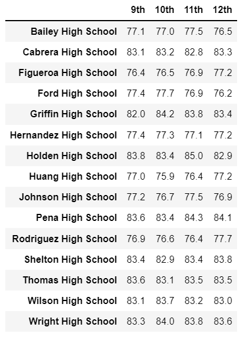
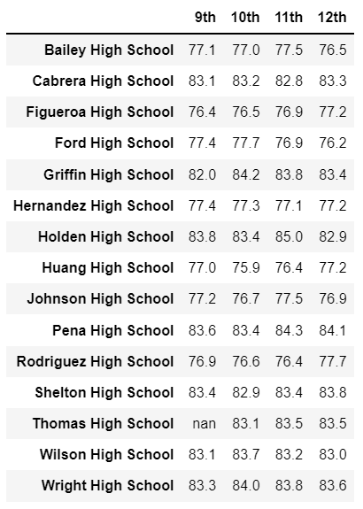
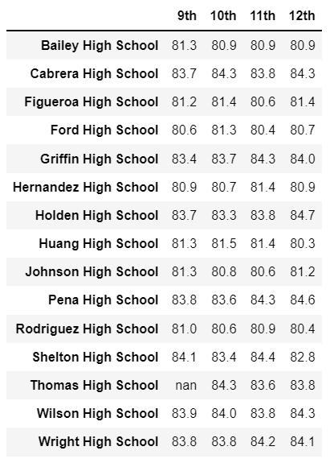

# School_District_Analysis

## Overview
The Chief Data Scientist for the City School District, Maria, has tasked us with looking into performance trends and patterns of over 39,000 students out of 15 district and charter schools to inform startegic decisions at the school district level.
We have created:
- a high-level snapshot of the district's key metrics, presented in a table format
- an overview of the key metrics for each school, presented in a table format
- tables presenting top 5 and bottom 5 performing schools, average math and reading scores per grade and per school, and school performance based on the budget per student, school size and type of school.
Now the School Board has notified Maria that the source data we bsed our analysis on shows evidence of academic dishonesty at Thomas High School. We have to replace math and reading grades for all ninth graders at THS with NaNs and run our analysis again.

## Results of the Updated Analysis

### District Summary

As shown in the table below, removing math and reading grades for all ninth graders at Thomas High School did have an impact at the school district level. The average math score across the district is down from 79.0 to 78.9, as well as the percentage of students passing math, passing reading and passing overall.

Original District Summary                |
:---------------------------------------:|
    |
Updated District Summary                 |
    |

 

### School Summary

As shown in the table below (and as expected), the results for Thomas High School are impacted by the change. Average scores in math and reading both remain the same, but the percentages of students passing math, passing reading and passing overall rose sharply from the 65%-70% range to over 90%.

Original School Summary                         |
:----------------------------------------------:|
    |
Updated School Summary                          |
    |

 

### THS performance Relative to Other Schools

The table attached here on the right shows that the performance of Thomas High School students relative to other schools appreciated significantly after removing the grades of the ninth graders. The average math and reading scores remained the same (see above) and so does the ranking of the school relative to others, but we can see that Thomas High School is now one of the top schools in the district in terms of the proportion of students passing math (from 9th to 7th place), passing reading (from 15th to 3rd place) and passing overall both math and reading (from 8th to 2nd).

 

 

### Average Math and Reading Scores

As shown in the table below, all math and reading grades for all schools remain unchanged with the exception of the math and reading grades for ninth graders at Thomas High School that we have replaced with NaN values. (click to enlarge the pictures)

 

<table align="center">
  <tr height=50px>
    <th>Original Math Scores by Grade</th>
    <th>Updated Math Scores by Grade</th>
    <th>Original Reading Scores by Grade</th>
    <th>Updated Reading Scores by Grade</th>
  </tr>
  <tr>
    <td> 
    <td> 
    <td> </td>
    <td> </td>
  </tr>
</table>

 
      
### Scores by School Spending

As shown in the table below, the summary by school spending remains unchanged, since the key budget metrics remained unchanged above :

  

 

### Scores by School Size

Similarly, the summary by school size remains unchanged :

  

 

### Scores by School Type

And finally, the summary by school type remains unchanged as well :

  

 

## Summary

After replacing all math and reading scores for ninth graders at Thomas High School with NaN values pending investigation, the four key takeaways of the updated analysis are :

1- The average math score across the district is down, as well as the percentage of students passing math, passing reading and passing overall.
2- The percentages of Thomas High School students passing math, passing reading and passing overall rose sharply.
3- Thomas High School is now one of the top schools in the district in terms of the proportion of students passing math (from 9th to 7th place), passing reading (from 15th to 3rd place) and passing overall both math and reading (from 8th to 2nd).
4- All other metrics and summaries reamin unchanged.
